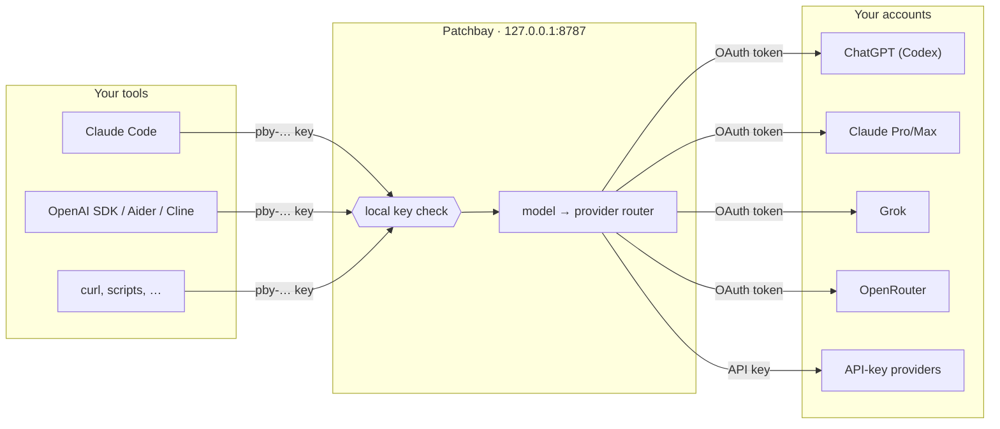

<div align="center">


# Patchbay

**One local endpoint for every model you have.**

Sign in to ChatGPT, Claude, Grok and OpenRouter once. Point any OpenAI- or
Anthropic-compatible tool at `http://127.0.0.1:8787`. Done.

[](https://github.com/Robinbinu/patchbay/releases)
[](https://github.com/Robinbinu/patchbay/actions/workflows/ci.yml)
[](go.mod)
[](LICENSE)


[**Download**](#install) · [Quick start](#quick-start) · [Use it with your tools](#use-it-with-your-tools) · [How it works](#how-it-works) · [FAQ](#faq)

</div>

---

You already pay for a ChatGPT plan, a Claude subscription, maybe SuperGrok or an
OpenRouter account. Every coding tool wants its own API key, its own base URL,
its own config. **Patchbay** is a small menu-bar app (and CLI) that signs in to
all of them and hands every tool on your machine **one URL and one key**.

> A patch bay is the panel in a studio that routes many sources to many
> destinations through one board. Same idea, for models.

## Highlights

- **Use the subscriptions you already have.** Sign in with your ChatGPT
  Plus/Pro/Team, Claude Pro/Max, SuperGrok / X Premium+ or OpenRouter account
  through each provider's own OAuth flow. API keys work too.
- **One endpoint, both dialects.** OpenAI `chat/completions` and `responses`,
  Anthropic `messages`, and one merged `/v1/models` list.
- **Model-based routing.** Ask for `claude-…`, `grok-…` or
  `openrouter/openai/gpt-…` and Patchbay sends it to whoever owns that model.
- **Lives in your menu bar.** See every account at a glance. The icon tells you
  when a login is about to expire; one click signs you back in. Tick
  **Launch at Login** and it's always there, and it tells you when a new
  version is out.
- **Local and private.** Listens on `127.0.0.1` only. Your provider tokens stay
  in `~/.patchbay` (mode `0600`); tools only ever see a local `pby-…` key.
  No telemetry, no cloud relay.
- **Tiny and dependency-free.** A single Go binary. The core proxy uses only
  the standard library.

## Install

> **Beta.** This is the first public beta. Expect rough edges and please
> [report them](https://github.com/Robinbinu/patchbay/issues/new/choose).

Grab the latest build from [**Releases**](https://github.com/Robinbinu/patchbay/releases).

| Platform | Download | What you get |
| --- | --- | --- |
| **macOS** 12+ (Apple silicon & Intel) | `Patchbay-<version>-macOS.dmg` | Menu-bar app |
| **Windows** 10/11 x64 | `Patchbay-<version>-windows-x64.zip` | Tray app + CLI |
| **Windows** on ARM | `Patchbay-<version>-windows-arm64.zip` | Tray app + CLI |
| **Linux** x64 / arm64 | `patchbay_<version>_linux_<arch>.tar.gz` | CLI (+ tray) |
| macOS CLI only | `patchbay_<version>_darwin_universal.tar.gz` | CLI (+ menu bar) |

Every release includes a `checksums.txt` (SHA-256).

<details>
<summary><b>macOS</b>: first launch</summary>

1. Open the `.dmg` and drag **Patchbay** to **Applications**.
2. Beta builds are not notarized yet, so the first time, **right-click
   Patchbay → Open → Open**. (Or run
   `xattr -dr com.apple.quarantine /Applications/Patchbay.app`.)
3. Patchbay appears in the menu bar (there is no Dock icon).

Want the CLI too? The app binary is the CLI:

```bash
sudo ln -sf /Applications/Patchbay.app/Contents/MacOS/Patchbay /usr/local/bin/patchbay
```

</details>

<details>
<summary><b>Windows</b>: first launch</summary>

1. Unzip anywhere (e.g. `%LOCALAPPDATA%\Patchbay`).
2. Run **Patchbay.exe**. Beta builds are not code-signed yet, so SmartScreen may
   warn: click **More info → Run anyway**.
3. Patchbay appears in the notification area (click `^` if hidden).

The command-line tool is `cli\patchbay.exe`. Add that folder to your `PATH`.

</details>

<details>
<summary><b>Linux</b></summary>

```bash
tar -xzf patchbay_*_linux_amd64.tar.gz
sudo install patchbay_*_linux_amd64/patchbay /usr/local/bin/
```

`patchbay serve` shows a tray icon on desktops with StatusNotifier /
AppIndicator support (KDE, GNOME with the AppIndicator extension, …), and runs
headless everywhere else.

</details>

<details>
<summary><b>From source</b> (Go 1.27+)</summary>

```bash
# Headless proxy + CLI (standard library only)
go install github.com/Robinbinu/patchbay/cmd/patchbay@latest

# With the menu-bar / tray UI
go install -tags tray github.com/Robinbinu/patchbay/cmd/patchbay@latest
```

Building the release packages (`.dmg`, Windows zips, archives) on a Mac:
`scripts/build-release.sh v0.1.0-beta.1`.

</details>

## Quick start

### With the app

1. Launch **Patchbay**. The proxy starts on `http://127.0.0.1:8787`.
2. Menu bar → pick a provider (ChatGPT, Claude, Grok, OpenRouter) → **Log In…**
   A checkmark means it's signed in and ready.
   Your browser opens; approve, and you're signed in.
3. Menu bar → **Connect a Tool** → copy the base URL and the API key into your
   tool.
4. Optional: tick **Launch at Login** so Patchbay starts with your computer.

### With the CLI

```bash
# 1. Sign in to the providers you want
patchbay login codex        # ChatGPT plan: opens the browser
patchbay login claude       # Claude Pro/Max: opens the browser
patchbay login grok         # SuperGrok / X Premium+: device code
patchbay login openrouter   # opens the browser, mints a durable key

# 2. (optional) Add API-key providers
patchbay provider add openai openai-key
patchbay provider key openai sk-...
patchbay provider add deepseek openai-key https://api.deepseek.com/v1
patchbay provider key deepseek sk-...

# 3. Check who you're signed in as and when it expires
patchbay status

# 4. Run it
patchbay serve
```

Example output:

```text
PROVIDER    KIND              STATE  ACCOUNT            ACCESS EXPIRES  LOGIN EXPIRES
codex       codex-oauth       ok     you@example.com    in 9d           in 59d
claude      anthropic-oauth   ok     you@example.com    in 7h           in 29d
grok        xai-oauth         ok     you@example.com    in 5h           -
openrouter  openrouter-oauth  ok     -                  -               -
```

## Use it with your tools

Every tool needs the same two things: the **base URL** and the **local key**
(`patchbay key`, or **Connect a Tool → Copy API Key** in the menu).

| Speaks… | Base URL |
| --- | --- |
| OpenAI API | `http://127.0.0.1:8787/v1` |
| Anthropic API | `http://127.0.0.1:8787` |

**Anthropic-compatible tools** (Claude Code, etc.):

```bash
export ANTHROPIC_BASE_URL=http://127.0.0.1:8787
export ANTHROPIC_API_KEY=$(patchbay key)
```

**OpenAI-compatible tools** (SDKs, Aider, Continue, Cline, and anything with a
"custom OpenAI base URL" field):

```bash
export OPENAI_BASE_URL=http://127.0.0.1:8787/v1
export OPENAI_API_KEY=$(patchbay key)
```

**See every model you can reach:**

```bash
curl -s http://127.0.0.1:8787/v1/models \
  -H "Authorization: Bearer $(patchbay key)" | jq -r '.data[] | "\(.id)\t\(.surface)"'
```

**Call one:**

```bash
curl http://127.0.0.1:8787/v1/chat/completions \
  -H "Authorization: Bearer $(patchbay key)" \
  -H "Content-Type: application/json" \
  -d '{"model": "openrouter/openai/gpt-5.5", "messages": [{"role": "user", "content": "Hello!"}]}'
```

```python
from openai import OpenAI
import subprocess

client = OpenAI(
    base_url="http://127.0.0.1:8787/v1",
    api_key=subprocess.check_output(["patchbay", "key"], text=True).strip(),
)
print(client.chat.completions.create(
    model="openrouter/openai/gpt-5.5",
    messages=[{"role": "user", "content": "Hello!"}],
).choices[0].message.content)
```

> **Match the format to the model (beta limitation).** Patchbay forwards your
> request body as-is; it does not translate between API formats yet. Each model
> in `/v1/models` lists its `surface`. Send `messages` models to
> `/v1/messages`, `responses` models to `/v1/responses`, and `chat` models to
> `/v1/chat/completions`.
>
> In practice: Anthropic-compatible tools only see (and can use) the
> `messages` models. OpenAI-compatible tools see every model, but through
> Chat Completions only the `chat` ones (OpenRouter, API-key providers) work.
> ChatGPT/Codex and Grok models need a tool that speaks the Responses API.

## Providers

| Provider | Kind | Sign-in | Surface |
| --- | --- | --- | --- |
| ChatGPT Plus / Pro / Team (Codex) | `codex-oauth` | OAuth (browser) | `responses` |
| Claude Pro / Max | `anthropic-oauth` | OAuth (browser) | `messages` |
| Grok (SuperGrok / X Premium+) | `xai-oauth` | OAuth (device code) | `responses` |
| OpenRouter | `openrouter-oauth` | OAuth (browser) → durable key | `chat` |
| Anthropic Console | `anthropic-key` | API key | `messages` |
| Any OpenAI-compatible API (OpenAI, DeepSeek, Together, Groq, local servers, …) | `openai-key` | API key + optional base URL | `chat` / `responses` |

`codex`, `claude`, `grok` and `openrouter` are configured out of the box: just
log in. Add more with `patchbay provider add <id> <kind> [base_url]`.

The OAuth flows (PKCE, loopback callback, device code, token refresh, identity
and expiry) follow the approach used by
[oh-my-pi](https://www.npmjs.com/package/@oh-my-pi/pi-ai)'s auth rules.

## How it works



1. Your tool calls Patchbay with the local `pby-…` key.
2. Patchbay reads the `model` field and looks it up in an index built from every
   signed-in provider's own model list. A prefixed id (`grok/grok-4.6`) picks
   the provider explicitly; a bare id is resolved automatically.
3. The request goes to that provider with **its** credentials (refreshed
   automatically when needed) and the provider's bare model id. The response,
   including SSE streams, is passed straight back.

### Endpoints

| Method | Path | Format |
| --- | --- | --- |
| `GET` | `/v1/models` | Every model, sorted. OpenAI format with `surface` by default; Anthropic format (only `messages` models) when the client sends `anthropic-version` |
| `POST` | `/v1/chat/completions` | OpenAI Chat Completions |
| `POST` | `/v1/responses` | OpenAI / Codex Responses |
| `POST` | `/v1/messages` | Anthropic Messages |
| `GET` | `/healthz` | Liveness, no key required |

Clients authenticate with the local key as `Authorization: Bearer pby-…` or
`x-api-key: pby-…`.

## CLI reference

```text
patchbay serve                         Start the proxy (and menu bar, in tray builds)
patchbay login <id>                    Sign in to an OAuth provider
patchbay logout <id>                   Forget a provider's credentials
patchbay status                        Every provider's sign-in state and expiry
patchbay provider add <id> <kind> [base_url]
patchbay provider key <id> <api-key>
patchbay provider rm <id>
patchbay key [rotate]                  Print (or rotate) the local API key
patchbay version                       Print the version
```

## Privacy & security

- Patchbay binds to `127.0.0.1` and refuses requests without the local key.
- State lives in `~/.patchbay` (`0700`):
  - `config.json`: listen address, local key, providers (`0600`)
  - `credentials.json`: OAuth tokens and expiry (`0600`)
- Patchbay only talks to the providers you configure: to list their models and
  to forward your requests. No telemetry, no third-party relay.
- The menu-bar app checks GitHub's public releases list
  (`api.github.com/repos/Robinbinu/patchbay/releases`) at launch and once a
  day to tell you about new versions. It sends no data beyond the request
  itself and never downloads or installs anything on its own.
- Rotate the local key any time with `patchbay key rotate`.

Found a vulnerability? See [SECURITY.md](SECURITY.md).

## FAQ

**Is this allowed by my provider's terms?**
Patchbay signs in with each provider's own OAuth flow and sends your requests
under your account, much like their official CLIs do. You are responsible for
using your subscriptions within each provider's terms.

**Port 8787 is taken.**
Change `listen` in `~/.patchbay/config.json` (e.g. `"127.0.0.1:8788"`) and
restart Patchbay.

**The menu-bar app and `patchbay serve` at the same time?**
Run one. They share the same config and port, so the second one can't listen.

**How do I update?**
The menu shows **Update Available: vX — Download** when a new release is out
(or use **Check for Updates…**). It opens the release page; download and
replace the app.

**A login expired.**
The menu-bar icon shows a badge. Open the provider's submenu and click
**Log In…**, or run `patchbay login <id>`.

## Roadmap

- [ ] Cross-format translation (call any model through any endpoint)
- [ ] More providers: Z.AI, Kimi Code, Gemini, GitHub Copilot
- [ ] Notarized macOS and signed Windows builds
- [ ] Homebrew / Scoop / winget packages

Ideas and votes welcome in [Issues](https://github.com/Robinbinu/patchbay/issues).

## Contributing

Bug reports, provider requests and PRs are all welcome. See
[CONTRIBUTING.md](CONTRIBUTING.md).

## Author

Made by **Robinbinu**: [GitHub](https://github.com/Robinbinu) ·
[LinkedIn](https://www.linkedin.com/in/michaelrobink)

If Patchbay saves you time, a ⭐ on the repo helps others find it.

## License

[MIT](LICENSE)
